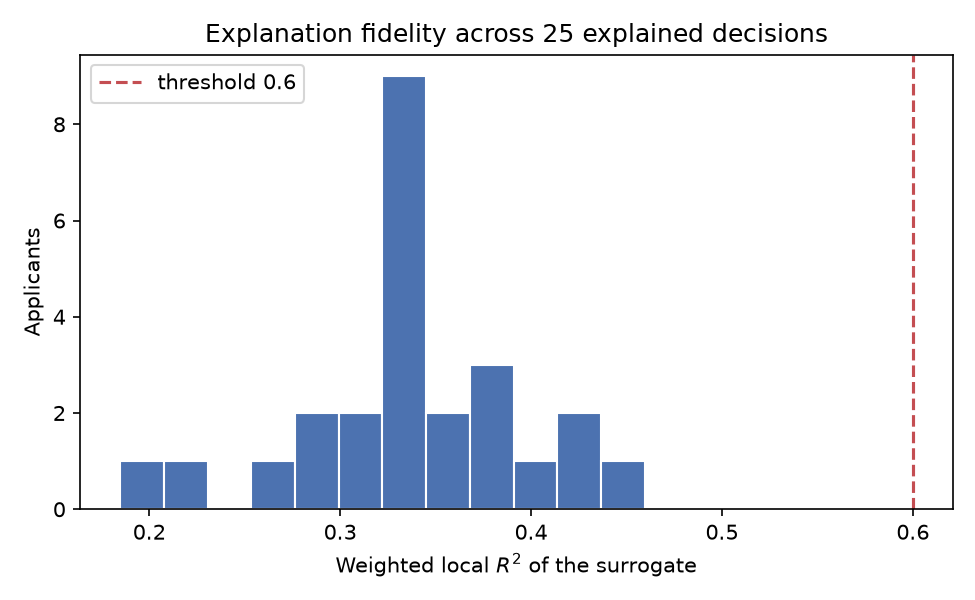

# Explaining a credit model, and checking whether the explanation is worth believing


A neural network scores German Credit applicants. LIME-style local surrogates explain
individual decisions. The point of the repository is the third step, which portfolio
projects usually skip: **the explanations are themselves validated**, and on this data
one of the three checks fails.

```bash
pip install -e ".[dev]"
python -m creditxai.pipeline   # downloads data, trains, explains, writes reports/
pytest -q
```

## Headline

| Check | What it asks | Result | |
| --- | --- | --- | --- |
| Fidelity | Does the surrogate track the model near the applicant? | mean local R² **0.34** | FAIL |
| Stability | Same top-5 attributes when only the random seed changes? | mean Jaccard **0.77** | PASS |
| Randomisation | Does the explanation change when the model is retrained on shuffled labels? | top-5 overlap **0.25** | PASS |

The fidelity failure is diagnosed rather than reported as a number. Fitting the same
neighbourhood two ways separates the causes:

| Linear fit on the same neighbourhood | Weighted R² |
| --- | --- |
| LIME representation (one indicator per attribute) | 0.39 |
| The actual encoded feature values | 0.55 |

So 0.16 of the shortfall is the representation — an indicator can record *whether* an
attribute changed but never *what it changed to* — and the remainder is the model's own
non-linearity. The practical conclusion: these explanations are a defensible ranking of
what to examine first, and are not a statement of the reason for a decline.



Full generated report: [`reports/explainability_report.md`](reports/explainability_report.md).

## The model

| Model | Test AUC | Role |
| --- | --- | --- |
| MLP, one hidden layer of 50 | 0.781 | the black box |
| Logistic regression | 0.792 | transparent comparison |

Worth stating plainly: **the black box is not better here.** On 1,000 rows the logistic
regression matches it. A model you cannot explain has to earn that cost in performance,
and on this dataset it does not.

## Two implementation details that changed the answer

Both were bugs in my own explainer, found by testing the explainer instead of trusting it.

1. **Perturb whole attributes, not one-hot columns.** Resampling dummy columns
   independently produces an applicant with two checking-account statuses at once — a
   point the model has never seen. Sampling at attribute level raised stability from
   0.55 to 1.00 on the focus case.
2. **The indicator must mean "value unchanged", not "attribute resampled".** A donor
   often supplies the same value, and counting that as a change feeds pure noise into
   the surrogate's target. Fixing it moved mean fidelity from 0.22 to 0.34.

## Layout

```
src/creditxai/
  data.py              download, decode A-codes to readable labels, attribute groups
  models.py            MLP (black box) and logistic regression (glass box)
  explain/global_.py   permutation importance
  explain/local.py     LIME-style weighted surrogate, written out rather than imported
  explain/quality.py   fidelity, stability, randomisation check, fidelity ceiling
  pipeline.py          end-to-end run and report generation
tests/                 explainer behaviour on models with known answers
```

`explain/local.py` is hand-written rather than `pip install lime` because the quality
checks need the neighbourhood, the kernel weights and the surrogate itself.

## Limitations

- A local surrogate describes a neighbourhood, not a rule, and says nothing about what
  would have made the application succeed. That is a counterfactual question.
- Permutation importance understates individual one-hot levels, since a shuffled column
  is partly recoverable from its siblings.
- Sex, marital status and foreign-worker status are excluded from the model, but proxies
  remain possible. Detecting that means testing outcomes by group, not reading an explanation.
- 1,000 rows of 1990s German banking. The method transfers; the numbers do not.

## Provenance

Rebuilt from an assignment for the Trustworthy AI course (MSc Data Science and Business
Analytics, University of Amsterdam), which trained the same MLP on this dataset and
explained it with the `lime` and `shap` packages. The surrogate, the quality checks, the
tests and the report here are my own; the course material is not included.
