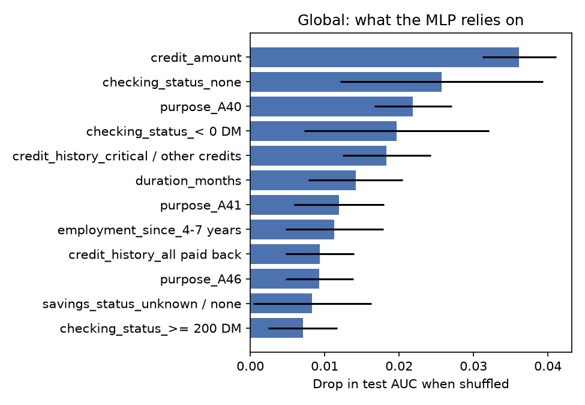
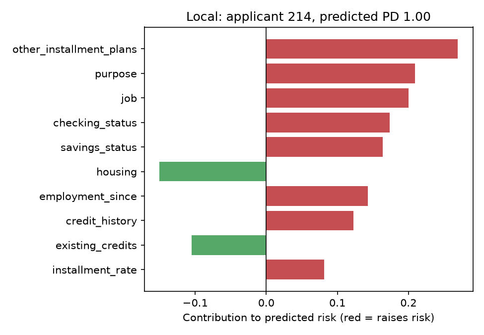

# Explaining a black-box credit model

Generated 2026-09-24 by `python -m creditxai.pipeline`. Data: Statlog (German Credit), 1,000 applicants, 30.0% bad risk. Sex/marital status and foreign-worker status are excluded from the features.

## 1. Models

| Model | Test AUC | Role |
| --- | --- | --- |
| MLP (50 hidden units) | 0.781 | the black box being explained |
| Logistic regression | 0.792 | transparent comparison |

The gap in AUC is -0.011. That difference is what the black box buys, and it is the number to weigh against having to explain it at all.

## 2. Are the explanations trustworthy?

| Check | What it asks | Result | Verdict |
| --- | --- | --- | --- |
| Fidelity | Does the surrogate track the model near the instance? | mean local R² 0.34 (min 0.18) | FAIL |
| Stability | Same top-5 features when only the seed changes? | mean Jaccard 0.77 (worst pair 0.67) | PASS |
| Randomisation | Does the explanation change when the model is trained on shuffled labels? | top-5 overlap 0.25, weight correlation +0.25 | PASS |

The fidelity check fails, and the next table says why it is the explanation method rather than the model that is at fault.

| Linear fit on the same neighbourhood | Weighted R² |
| --- | --- |
| LIME representation: one on/off indicator per attribute | 0.392 |
| The actual encoded feature values | 0.549 |

Two ceilings stack up here. The representation costs 0.16 of R²: an indicator records *whether* an attribute changed, never *what it changed to*. Even given the actual values, a linear fit reaches only 0.55, so the rest is the model's own non-linearity across a neighbourhood where predicted PD spans almost the whole interval (SD 0.41). Presenting the top-5 features from a surrogate with an R² of 0.34 as *the reason* for a decline would overstate what was measured. As a ranking of what to examine first, it is still useful.

## 3. Global attribution

| Feature | AUC drop when shuffled | SD |
| --- | --- | --- |
| credit_amount | 0.0361 | 0.0050 |
| checking_status_none | 0.0257 | 0.0136 |
| purpose_A40 | 0.0219 | 0.0052 |
| checking_status_< 0 DM | 0.0196 | 0.0124 |
| credit_history_critical / other credits | 0.0183 | 0.0059 |
| duration_months | 0.0141 | 0.0063 |
| purpose_A41 | 0.0119 | 0.0061 |
| employment_since_4-7 years | 0.0113 | 0.0066 |

## 4. One decision, explained

Applicant 214, predicted probability of default 1.00, surrogate local R² 0.38.

| Feature | Contribution to risk |
| --- | --- |
| other_installment_plans | +0.2695 |
| purpose | +0.2091 |
| job | +0.2000 |
| checking_status | +0.1737 |
| savings_status | +0.1640 |
| housing | -0.1506 |
| employment_since | +0.1427 |
| credit_history | +0.1225 |

## 5. Limitations

- A local surrogate describes a neighbourhood, not a rule. It does not say what would have made this application succeed; that is a counterfactual question and a different method.
- Permutation importance on one-hot columns understates individual levels, because a shuffled column is partly recoverable from its siblings.
- Excluded protected attributes can still act through proxies. Checking that means testing outcomes by group, not reading an explanation.
- 1,000 rows from 1994 German banking. The method transfers; the coefficients do not.